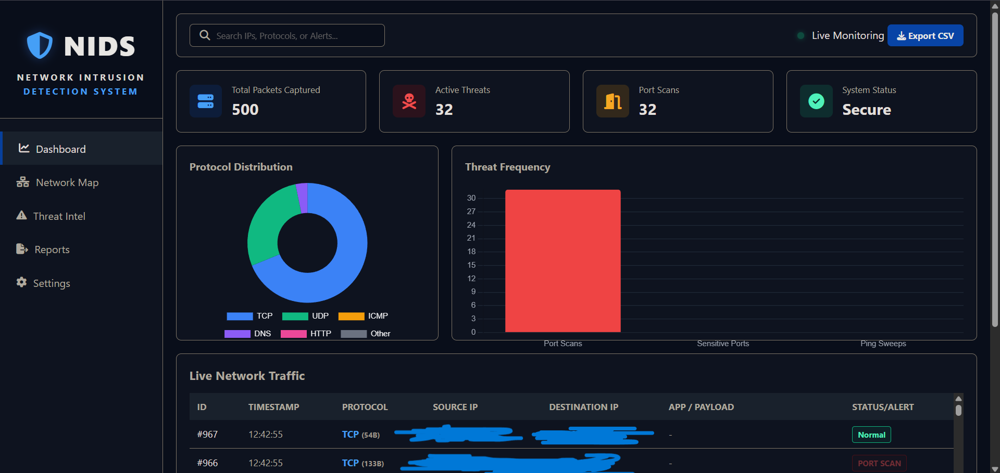
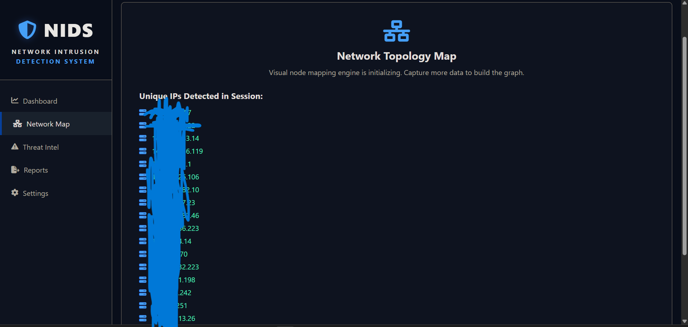
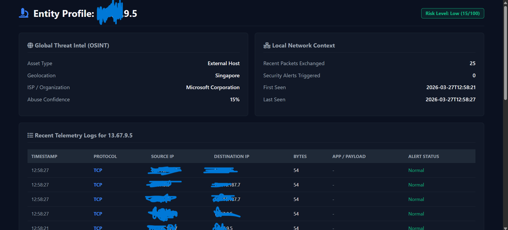
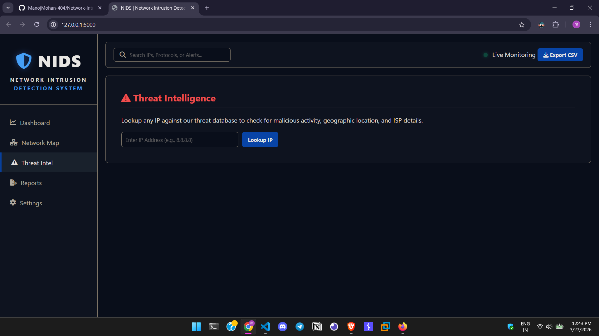
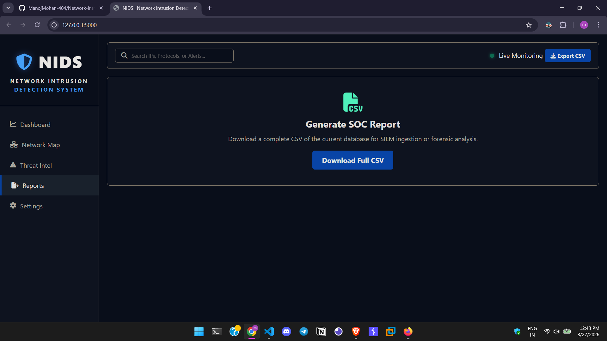
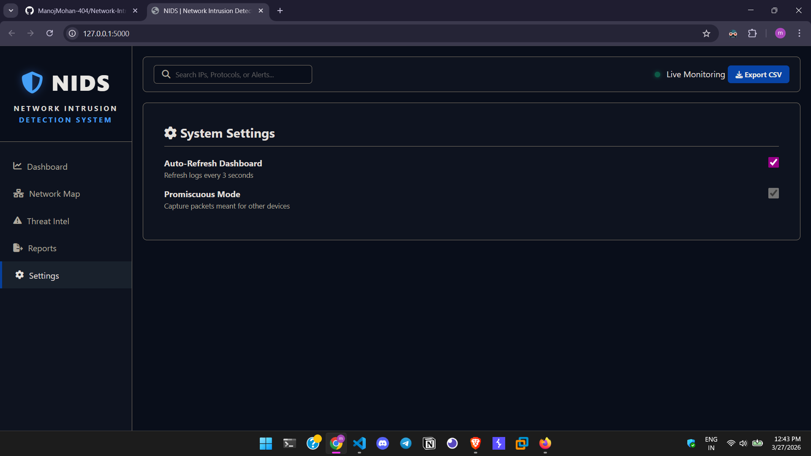

# 🛡️ Network Intrusion Detection System (NIDS)
### Advanced Network Security & Deep Packet Inspection Dashboard


> **Developed by:** Manoj Mohan • MCA Student & CyberSecurity Learner

---

> [!IMPORTANT]
> **Development Status: ⚠️ Alpha / Proof-of-Concept**
> This project is currently in its initial development stage. While the core sniffing and detection engines are functional, it is not yet a fully developed enterprise solution and is intended for **educational and research purposes only.**

---

## 📑 Project Overview

This project is a **Network Intrusion Detection System (NIDS)** designed to monitor, analyze, and identify suspicious activities in real-time. Unlike basic sniffers, this system utilizes **Deep Packet Inspection (DPI)** to look inside the application layer of network traffic.

The system features a **Pro-Grade Security Dashboard** to visualize live telemetry, track threat actors, and perform forensic analysis — all running locally to ensure data privacy.

---

## 📸 Screenshots

### 🖥️ 1. Main Dashboard — Live Telemetry & Threat Monitoring

> *Real-time packet capture with Protocol Distribution chart, Threat Frequency bar graph, and Live Network Traffic feed showing Source IP, Destination IP, Protocol, and Alert Status.*

---

### 🗺️ 2. Network Map — Topology & Unique IP Detection

> *Visual node mapping of all unique IPs detected in the current session. Tracks every device communicating on the monitored network segment.*

---

### 🕵️ 3. Entity Profile — Deep-Dive IP Investigation

> *Per-IP forensic profile showing OSINT data (Geolocation, ISP, Abuse Confidence), Local Network Context, Risk Level score, and full telemetry log history.*

---

### ⚠️ 4. Threat Intelligence — IP Lookup & OSINT

> *Lookup any IP address against the threat database to check for malicious activity, geographic location, and ISP details in real-time.*

---

### 📂 5. Reports — SOC Report Generation

> *Generate and download a complete CSV export of the current session database for SIEM ingestion or offline forensic analysis.*

---

### ⚙️ 6. Settings — System Configuration

> *Configure Auto-Refresh interval (every 3 seconds) and toggle Promiscuous Mode to capture packets meant for other devices on the network.*

---

## ✨ Key Features

- 🚀 **Live Telemetry Feed:** Real-time packet injection with smooth CSS animations.
- 🔍 **Deep Packet Inspection (DPI):** Extracts DNS queries, HTTP URIs, and ICMP payloads.
- 🎯 **Behavioral Analytics:** Identifies Stealth Port Scans and Sensitive Port access.
- 📂 **Session-Based Logging:** Automatically generates isolated SQLite databases for every monitoring session.
- 🕵️ **Entity Investigation:** Dedicated drill-down profiles for every detected IP address.
- 🌐 **Threat Intelligence:** Real-time OSINT lookup — Geolocation, ISP, Abuse Confidence score.
- 📊 **SOC Report Export:** Download full session logs as CSV for SIEM ingestion or forensic analysis.
- ⚙️ **Promiscuous Mode:** Capture packets meant for other devices on the same network segment.

---

## 🛠️ Technology Stack

| Layer | Technology | Purpose |
|---|---|---|
| **Backend** | 🐍 Python 3.10+ | Core logic and multi-threaded processing |
| **Web Engine** | 🌐 Flask | High-performance REST API and routing |
| **Sniffer** | 📡 Scapy | Low-level packet crafting and dissection |
| **Database** | 🗄️ SQLite | Relational storage for forensic logs |
| **Frontend** | 🎨 HTML5 / CSS3 | Premium "Dark Mode" Enterprise UI |
| **Charts** | 📊 Chart.js | Dynamic protocol and threat visualization |

---

## 🔍 The Detection Engine

The system operates across three critical stages of the **OSI Model:**

1. **Capture (Layer 2–3):** Raw frames are captured via the network interface.
2. **Dissection (Layer 4):** TCP/UDP/ICMP headers are parsed for port-based anomalies.
3. **Inspection (Layer 7):** The Application Payload is analyzed to reveal DNS requests and HTTP methods.

---

## 📁 Project Structure

```
Network-Intrusion-Detection-System/
│
├── app.py                    # Flask app + REST API routing
├── sniffer.py                # Scapy packet capture & DPI engine
├── database.py               # SQLite session-based logging
├── requirements.txt          # Python dependencies
│
├── templates/                # HTML dashboard views
│   ├── index.html            # Main dashboard
│   ├── network_map.html      # Network topology map
│   ├── entity.html           # Entity profile page
│   ├── threat_intel.html     # Threat intelligence lookup
│   ├── report.html           # SOC report export
│   └── settings.html         # System settings
│
├── static/                   # Frontend assets
│   ├── css/                  # Dark mode styles
│   └── js/                   # Chart.js & dashboard logic
│
└── assets/
    └── screenshots/          # README screenshots
        ├── dashboard.png
        ├── network-map.png
        ├── entity-profile.png
        ├── threat-intelligence.png
        ├── report.png
        └── settings.png
```

---

## 🚀 Installation & Deployment

This project requires **administrative privileges** for raw network packet capture.

### 1️⃣ Clone the Repository

```bash
git clone https://github.com/ManojMohan-404/Network-Intrusion-Detection-System
cd Network-Intrusion-Detection-System
```

### 2️⃣ Setup Virtual Environment

**🪟 Windows:**
```bash
python -m venv venv
venv\Scripts\activate
pip install -r requirements.txt
```

**🐧 Linux / macOS:**
```bash
python3 -m venv venv
source venv/bin/activate
pip install -r requirements.txt
```

### 3️⃣ Run the Application

```bash
# Windows
python app.py

# Linux / macOS (sudo required for raw packet access)
sudo venv/bin/python3 app.py
```

### 4️⃣ Open the Dashboard

```
http://localhost:5000
```

---

## ⚠️ Technical Limitations & Guardrails

| Limitation | Details |
|---|---|
| 🔒 **TLS Encryption** | Cannot inspect HTTPS/TLS-encrypted payloads without SSL-stripping |
| 💻 **Hardware Dependency** | Performance depends on CPU's ability to process raw sockets in real-time |
| 🌐 **Network Scope** | Best suited for local network segments (LAN) or home lab monitoring |
| 🔑 **Privileges Required** | Needs admin/root access to capture raw packets |

---

## 👤 Developer

**Manoj Mohan** — MCA Student & CyberSecurity Learner

🌐 [LinkedIn](https://www.linkedin.com/in/manojmohan404) | 🐦 [X (Twitter)](https://x.com/manoj40A)

---

## 📄 License

This project is licensed under the **MIT License** — see the [LICENSE](LICENSE) file for details.

---

> ⭐ If you found this project helpful, consider giving it a star! It motivates further development.

---
*Thanks for visiting this project* 🙏